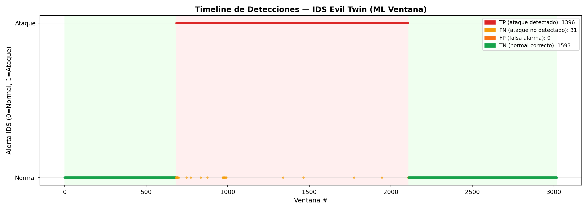
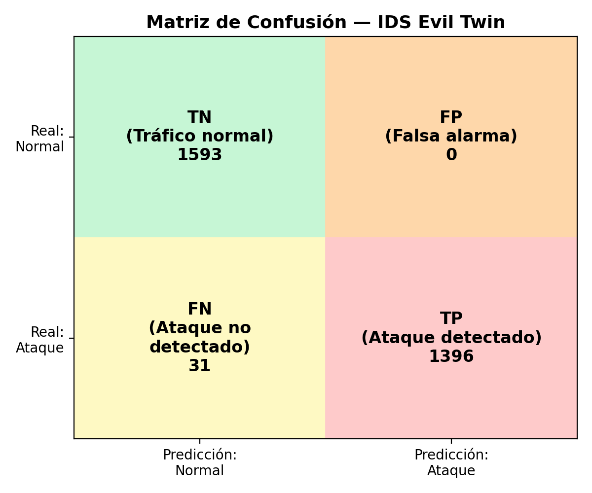
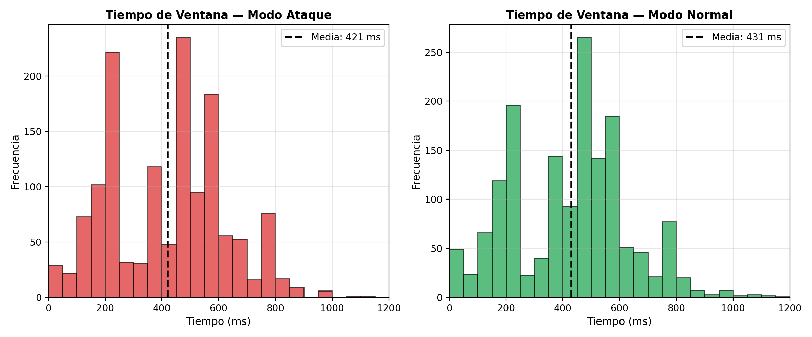
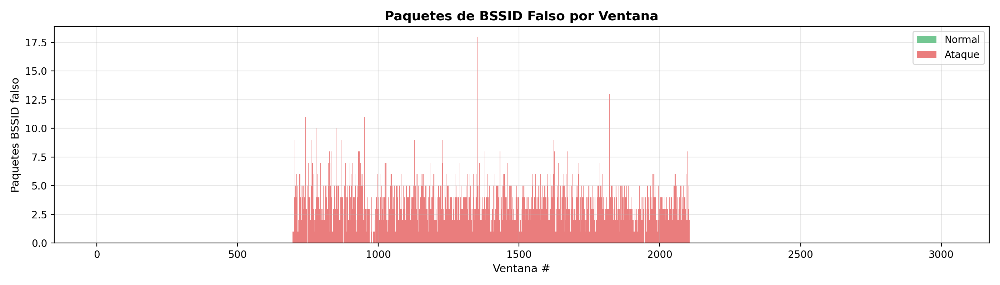

# 🛡️ Wi-Fi Intrusion Detection System for IoT with Machine Learning

<p align="center">
  <strong>Trabajo Fin de Grado — Ingeniería Electrónica de Comunicaciones</strong><br>
  Universidad Complutense de Madrid · 2025/2026
</p>

<p align="center">
  
  
  
  
  
</p>

---

## 📌 Descripción

Sistema de detección y prevención de intrusiones (IDS/IPS) en redes Wi-Fi orientado a entornos IoT, implementado en tiempo real sobre una Raspberry Pi 5. El sistema captura tráfico inalámbrico en modo monitor, lo analiza mediante modelos de Machine Learning (Random Forest con hiperparámetros optimizados) y genera alertas automáticas ante ataques de **Deauthentication** y **Evil Twin**.

El proyecto incluye:
- **Dashboard web** con monitorización en tiempo real, alertas de seguridad y control IPS integrado
- **Mini-IPS** que blinda automáticamente el dispositivo IoT al AP legítimo ante ataques detectados
- **Firmware Evil Twin WPA2** con contraseña extraída del firmware del dispositivo (ataque combinado hardware-red), portal cautivo y broker MQTT falso
- **Análisis de seguridad física** del hardware IoT (extracción de firmware, UART, JTAG, eFuses)

**Autor:** José David Conde Quispe  
**Tutor:** Guillermo Botella Juan

---

## 🏗️ Arquitectura del Sistema

```
                    ┌──────────────────────────────────┐
                    │      SISTEMA DE DETECCIÓN        │
                    │        (Raspberry Pi 5)          │
                    │                                  │
                    │  wlan1 (AR9271) ── AP legítimo   │
                    │  wlan2 (AR9271) ── Modo monitor  │
                    │  Mosquitto MQTT ── Broker        │
                    │  Dashboard Web ── Flask+SocketIO │
                    │    + Control IPS + 4 estados     │
                    └──────────┬──────────┬────────────┘
                               │          │
                    ┌──────────┘          └───────────┐
                    │                                 │
          ┌─────────────────┐              ┌───────────────────┐
          │   CLIENTE IoT   │              │   MAC (Python)    │
          │  ESP32-C3 Rust  │              │                   │
          │  Board          │              │  IDS Deauth       │
          │  Temp/Hum/IMU   │──── MQTT ──→ │  IDS Evil Twin    │
          │  + Mini-IPS     │              │  Alertas MQTT     │
          │  + LED estados  │              │  (vía SSH)        │
          └─────────────────┘              └───────────────────┘
                    ┌──────────────────┐
                    │   ATACANTES      │
                    │                  │
                    │  ESP32 Marauder  │── Deauth
                    │  ESP32 WROOM-32U │── Evil Twin WPA2
                    │                  │   + Portal Cautivo
                    │                  │   + Broker MQTT falso
                    └──────────────────┘
```

---

## 🎯 Características Principales

- **Detección de Deauthentication** — Random Forest con hiperparámetros optimizados (AWID3). TPR ~99.9%, FPR ~0.0%.
- **Detección de Evil Twin** — Random Forest con 17 features de ventana (tráfico real). TPR ~97.8%, FPR ~0.0%.
- **Optimización de hiperparámetros** — Evaluación de múltiples configuraciones y selección de la óptima por F1-score para ambos modelos.
- **Mini-IPS** — Blindaje automático del dispositivo IoT al BSSID del AP legítimo ante alertas del IDS, controlable desde el dashboard o Serial.
- **Dashboard web con 4 estados de seguridad** — Verde (seguro), azul (blindado), rojo (amenaza vulnerable), azul (amenaza blindada). Incluye botón de control IPS.
- **Alertas MQTT vía SSH** — Los IDS publican alertas al broker mediante SSH → mosquitto_pub. El dashboard y la Rustboard reaccionan en tiempo real.
- **Evil Twin WPA2** — AP falso con la misma contraseña extraída del firmware del dispositivo (Parte 4 → Parte 3), portal cautivo que replica el dashboard, broker MQTT falso que intercepta datos de sensores.
- **Análisis de seguridad física** — Extracción de firmware, credenciales en texto plano, UART/USB expuesto, JTAG abierto, ausencia de Secure Boot, MQTT sin cifrar.

---

## 📁 Estructura del Repositorio

```
tfg-wifi-ids-iot-ml/
├── models/                            # Entrenamiento de modelos ML
│   ├── train_deauth_awid.py           # Deauth con AWID + optimización hiperparámetros
│   ├── train_eviltwin_real.py         # Evil Twin con datos reales + optimización
│   └── capture_training_data.py       # Captura de tráfico para entrenamiento
│
├── ids/                               # Detección en tiempo real
│   ├── ids_deauth.py                  # IDS Deauth + métricas + alertas MQTT vía SSH
│   └── ids_eviltwin.py                # IDS Evil Twin + métricas + alertas MQTT vía SSH
│
├── firmware/                          # Código de los dispositivos
│   ├── rustboard_client/              # Cliente IoT + Mini-IPS (ESP32-C3 Rustboard)
│   │   └── rustboard_client.ino
│   └── evil_twin/                     # Atacante Evil Twin WPA2 (ESP32 WROOM-32U)
│       └── evil_twin.ino
│
├── dashboard/                         # Dashboard web IoT + Control IPS
│   ├── app.py                         # Servidor Flask + SocketIO + MQTT + IPS control
│   └── templates/
│       ├── login.html
│       └── dashboard.html
│
├── raspi/                             # Configuración Raspberry Pi
│   ├── hostapd.conf                   # Configuración del AP
│   ├── dnsmasq.conf                   # Configuración DHCP/DNS
│   └── setup_guide.md                 # Guía de configuración paso a paso
│
├── security-analysis/                 # Análisis de seguridad física (Parte 4)
│   ├── Parte4_Seguridad_Fisica.md
│   └── efuse_summary.txt
│
├── docs/                              # Documentación y análisis
│   └── analisis/                      # Gráficas y scripts de análisis de métricas
│       ├── analisis_metricas_eviltwin.py
│       ├── timeline_detecciones_eviltwin.png
│       ├── confusion_matrix_eviltwin.png
│       ├── tiempos_deteccion_eviltwin.png
│       └── bssid_falsos_eviltwin.png
│
├── README.md
├── requirements.txt
├── .gitignore
└── LICENSE
```

---

## 🤖 Modelos de Machine Learning

### Modelo Deauth (AWID3)

| Propiedad | Valor |
|-----------|-------|
| Algoritmo | Random Forest (hiperparámetros optimizados) |
| Dataset | AWID3 — Deauthentication (archivos 0-21 train, 22-32 test) |
| Features | 6 (type, subtype, signal_dbm, frame_len, retry, duration) |
| Mejor config | n_estimators=100, max_depth=10, class_weight=None |
| Clasificación | Por paquete individual |
| Ventana de alerta | 50 paquetes, umbral >3 maliciosos |

### Modelo Evil Twin (Datos Reales)

| Propiedad | Valor |
|-----------|-------|
| Algoritmo | Random Forest (hiperparámetros optimizados) |
| Dataset | Tráfico real capturado en laboratorio (~200k paquetes) |
| Features | 17 features de ventana (estadísticas + Evil Twin específicas) |
| Mejor config | Todas las configuraciones evaluadas dan resultado idéntico (features altamente discriminativas) |
| Clasificación | Por ventana de 50 paquetes |
| Features clave | `paquetes_bssid_falso` (42%), `bssids_con_ssid` (34%), `signal_var_same_ssid` (6%) |

### Evolución del enfoque ML

1. **Isolation Forest** (no supervisado) → Descartado por exceso de falsos positivos
2. **Random Forest por paquete** (supervisado, AWID3) → Funciona para Deauth, no para Evil Twin en tráfico real
3. **Random Forest por ventana** (supervisado, datos reales) → Modelo final para Evil Twin con 17 features agregadas

---

## 📊 Métricas de Rendimiento

### Optimización de hiperparámetros (Deauth)

Se evaluaron 6 configuraciones de hiperparámetros sobre el dataset AWID3 (1.1M paquetes de entrenamiento, 526k de test) y se seleccionó la óptima por F1-score:

| # | n_est | depth | weight | F1 | TPR | FPR |
|---|-------|-------|--------|-----|-----|-----|
| ★ | 100 | 10 | None | 1.0000 | 99.9% | 0.0% |
| 2 | 150 | None | None | 0.9998 | 99.4% | 0.0% |
| 3 | 300 | 20 | None | 0.9996 | 98.9% | 0.0% |

La configuración con `class_weight='balanced'` reduce el TPR a 83.1% debido al desbalanceo del dataset (99.9% normal, 0.1% ataque), demostrando que el balanceo de clases es contraproducente en este escenario.

### Validación con hardware real (Evil Twin)

Evaluación sobre **3020 ventanas** en tiempo real (1593 normales, 1427 de ataque) durante un ataque Evil Twin controlado en el laboratorio:

| Métrica | Valor |
|---------|-------|
| **TPR (Recall)** | 97.8% (1396/1427) |
| **FPR** | 0.0% (0/1593) |
| **Precision** | 100.0% |
| **F1-Score** | 98.9% |
| **Accuracy** | 99.0% |
| **Tiempo medio detección** | 421 ms |

### Resumen de rendimiento

| Modelo | TPR | FPR | F1-Score | Tiempo detección |
|--------|-----|-----|----------|-----------------|
| **Deauth** | 99.9% | 0.0% | 100.0% | ~550 ms |
| **Evil Twin** | 97.8% | 0.0% | 98.9% | ~421 ms |

---

## 📈 Análisis Visual de Resultados (Evil Twin)

### Timeline de Detecciones

Cada punto representa una ventana de 50 paquetes clasificada por el IDS. El fondo verde indica periodos de tráfico normal y el fondo rojo periodos de ataque Evil Twin activo. Los puntos rojos superiores son ataques detectados correctamente (TP), los puntos amarillos son ataques no detectados (FN = 31), y los puntos verdes inferiores son tráfico normal clasificado correctamente (TN). No hay ningún punto naranja (FP = 0), lo que confirma la ausencia total de falsas alarmas.



### Matriz de Confusión

Visualización de los cuatro cuadrantes de clasificación. De las 3020 ventanas analizadas, 1593 ventanas normales fueron clasificadas correctamente (TN), 1396 ataques fueron detectados (TP), solo 31 ataques pasaron desapercibidos (FN), y no hubo ninguna falsa alarma (FP = 0). La ausencia de falsos positivos es especialmente relevante en entornos IoT donde las falsas alarmas podrían provocar acciones defensivas innecesarias.



### Distribución de Tiempos de Detección

Histogramas del tiempo que tarda en llenarse cada ventana de 50 paquetes. Este tiempo depende de la densidad de tráfico Wi-Fi en el entorno, no del rendimiento del modelo (que clasifica de forma instantánea). En modo ataque (izquierda) hay mayor dispersión debido al tráfico adicional generado por el Evil Twin, con una media de 421 ms. En modo normal (derecha) los tiempos se concentran alrededor de 400-500 ms, con algunos outliers en entornos de bajo tráfico.



### Paquetes de BSSID Falso por Ventana

Número de paquetes provenientes del BSSID del Evil Twin en cada ventana. Durante el periodo normal (ventanas 0-600 y 2100-3020) el recuento es cero, confirmando la ausencia del AP falso. Durante el ataque (ventanas 600-2100) se observan entre 2 y 18 paquetes del Evil Twin por ventana. Las ventanas con 0 paquetes del BSSID falso dentro del periodo de ataque corresponden a los 31 FN donde el modelo no detectó el ataque, ya que en esas ventanas concretas no llegaron paquetes del Evil Twin al sensor de captura.



---

## 🛡️ Sistema IPS (Intrusion Prevention)

El dispositivo IoT (Rustboard) implementa un mini-IPS que reacciona ante alertas del IDS:

### Estados del sistema

| Estado | LED Rustboard | Dashboard | Descripción |
|--------|--------------|-----------|-------------|
| Normal, IPS off | 🌈 Arcoíris | ✅ Verde — "Red segura" | Sin amenazas, sin protección activa |
| Normal, IPS on | 🔵 Azul fijo | 🔵 Azul — "Red segura — Conexión blindada" | Sin amenazas, conectado al BSSID legítimo |
| Amenaza, IPS off | 🔴 Rojo parpadeo | 🔴 Rojo — "RED INSEGURA — AMENAZA DE EVIL TWIN" | Ataque detectado, dispositivo vulnerable |
| Amenaza, IPS on | 🟣 Morado fijo | 🔵 Azul — "Red sospechosa — Conexión blindada" | Ataque detectado, dispositivo protegido |

### Control

- **Dashboard:** Botón "Activar/Desactivar IPS" (MQTT → `tfg/ips_control`)
- **Serial Monitor:** Comandos `ips on`, `ips off`, `status`, `help`

---

## 🛠️ Hardware Utilizado

| Dispositivo | Rol | Interfaz |
|-------------|-----|----------|
| Raspberry Pi 5 | Sistema de detección (IDS), broker MQTT, dashboard | wlan0 (SSH), wlan1 (AP), wlan2 (monitor) |
| Atheros AR9271 #1 | Punto de acceso legítimo | wlan1 en modo AP |
| Atheros AR9271 #2 | Captura de tráfico | wlan2 en modo monitor |
| ESP32-C3 Rustboard | Cliente IoT + Mini-IPS | WiFi + MQTT + LED NeoPixel |
| ESP32 WROOM-32U #1 | Atacante Deauth | Firmware Marauder |
| ESP32 WROOM-32U #2 | Atacante Evil Twin | Firmware `evil_twin.ino` (WPA2) |

---

## ⚙️ Instalación y Uso

### Requisitos

```bash
pip install pandas scikit-learn joblib flask flask-socketio
```

### 1. Configurar la Raspberry Pi

Seguir la guía en [`raspi/setup_guide.md`](raspi/setup_guide.md) para configurar:
- AP con hostapd (wlan1)
- DHCP con dnsmasq
- Modo monitor (wlan2)
- Broker MQTT (Mosquitto con `listener 1883 0.0.0.0`)

### 2. Entrenar los modelos

```bash
# Deauth (requiere dataset AWID3)
python models/train_deauth_awid.py

# Evil Twin (requiere captura previa con capture_training_data.py)
python models/train_eviltwin_real.py
```

### 3. Lanzar el Dashboard

```bash
cd dashboard
sudo python app.py
# Acceder desde http://192.168.50.1:8080 (login: admin / tfg2026)
```

### 4. Lanzar el IDS

> **Nota:** Cambiar `RASPI_IP` en los scripts según la red actual.

```bash
# Detección de Deauth
python ids/ids_deauth.py

# Detección de Evil Twin
python ids/ids_eviltwin.py
```

### 5. Flashear firmware

- **Rustboard:** Arduino IDE → ESP32-C3 Dev Module → USB CDC On Boot: Enabled. Requiere librería `ArduinoJson`.
- **Evil Twin:** Arduino IDE → ESP32 Dev Module.

---

## 🔬 Dataset

- **Deauth:** Dataset público [AWID3 (Aegean Wireless Intrusion Dataset)](https://icsdweb.aegean.gr/awid/)
- **Evil Twin:** Tráfico real capturado en el laboratorio con `models/capture_training_data.py`

> Los datasets no se incluyen en el repositorio por su tamaño. AWID3 debe descargarse desde el enlace oficial.

---

## 🔒 Análisis de Seguridad Física

Se realizó un análisis completo de la seguridad del hardware IoT (ESP32-C3 Rustboard), documentado en [`security-analysis/Parte4_Seguridad_Fisica.md`](security-analysis/Parte4_Seguridad_Fisica.md):

| Vulnerabilidad | Vector | Impacto |
|----------------|--------|---------|
| Extracción de firmware | `esptool read-flash` | Credenciales WiFi/MQTT en texto plano |
| UART/USB expuesto | Monitor Serie sin autenticación | Fuga de datos de sensores y configuración |
| JTAG habilitado | Depuración por USB/pines | Acceso total a memoria del dispositivo |
| Sin Secure Boot | Inyección de firmware malicioso | Control total del dispositivo |
| MQTT sin cifrar | Sniffing con `mosquitto_sub` | Intercepción de datos de sensores |

La contraseña Wi-Fi extraída del firmware se utilizó para crear el Evil Twin WPA2, demostrando un **ataque combinado hardware-red** donde el compromiso físico del dispositivo potencia la efectividad de los ataques inalámbricos.

---

## 🚀 Trabajo Futuro

- **Cloud Security:** Integración con servicios cloud (AWS IoT Core, Azure IoT Hub) para monitorización remota.
- **Secure Boot + Flash Encryption:** Activación de protecciones hardware en el ESP32-C3.
- **TLS en MQTT:** Cifrado de las comunicaciones entre dispositivos y broker.
- **Modelo multiclase:** Unificación de los detectores en un solo modelo capaz de clasificar múltiples ataques.
- **Notificaciones remotas:** Alertas por Telegram o push notifications.
- **Fingerprinting de radio:** Verificación de APs mediante características de señal para prevenir MAC spoofing.

---

## ⚠️ Aviso Legal

Este proyecto es de investigación académica. Todas las técnicas de ataque se utilizan exclusivamente en un laboratorio controlado y aislado, sin conexión a redes de producción. El uso de estas técnicas fuera de un entorno autorizado puede ser ilegal.

---

## 📄 Licencia

Este proyecto está bajo la licencia MIT. Ver [`LICENSE`](LICENSE) para más detalles.
